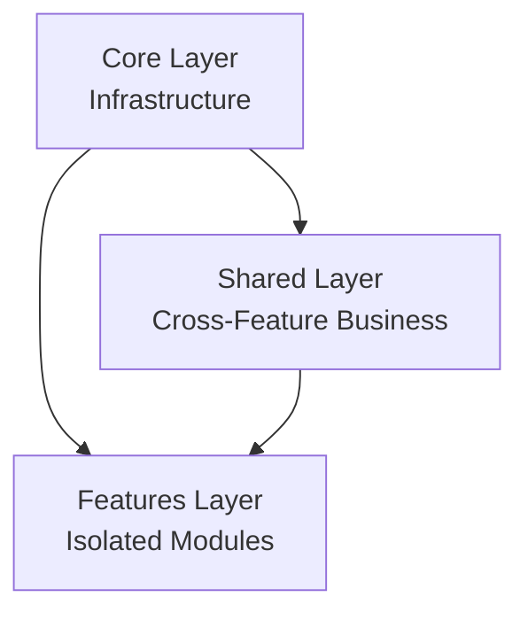
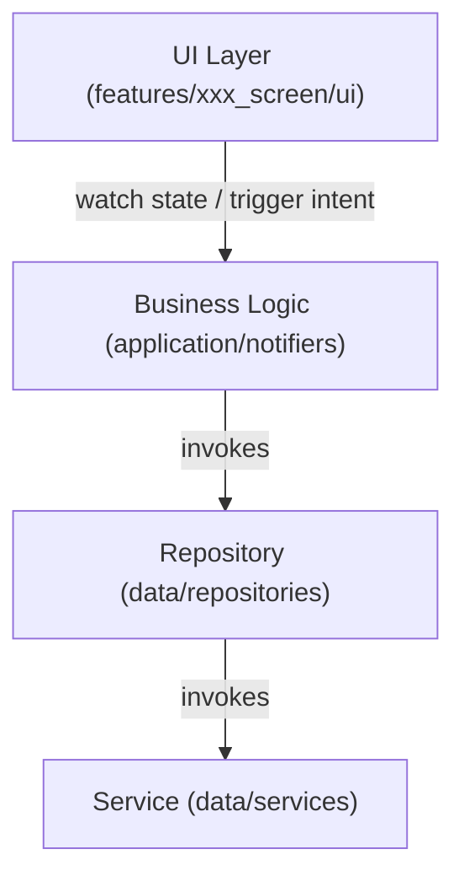

# AIPos App Rules (`/base-app`)

> This document is the Flutter/Dart app appendix of the [AIPos Constitution](../constitution.md). All Flutter app development **MUST** comply with these rules.
> Default execution entrypoint: [../rules-core/base-app.md](../rules-core/base-app.md). Use the core file first, then return here for full explanations, edge cases, and appendices.

### App AI Tool Impact Rule (APP-AI-012)

- Every new or changed App user-facing function **MUST** record affected Engine operation IDs and AI tool IDs in its spec, plan, task, and review. State the same-task tool update, verified-no-change evidence, or concrete no-impact reason.
- An App business action backed by a new or changed Engine operation **MUST** ship its permitted AI tool in the same task or prove existing tool coverage. App-only is not by itself a `NON_CALLABLE` reason; an intrinsic exclusion requires the user's explicit scope decision under Constitution §II-B.
- Changes to shared operation validation, permissions, workspace or resource scope, results, side effects, or errors **MUST** update affected callable tools and protected Engine behavior tests. A purely visual or client-local change needs only a brief no-impact reason.
- Every source-changing App PR must include the structured `AI_TOOL_IMPACT` declaration. CI rejects omissions and malformed outcomes; review must verify the recorded IDs and the truth of no-impact or verified-no-change claims.

## 1. Technology Stack

*   **Framework**: Flutter (multi-platform: macOS, Windows, iOS, Android)
*   **Language**: Dart (strict null safety)
*   **State Management**: Riverpod + `riverpod_generator` (code-generated providers)
*   **Serialization**: `json_annotation` + `json_serializable` (code-generated `fromJson`/`toJson`)
*   **Routing**: GoRouter + `flutter_oxygen` Route abstraction
*   **Package Name**: `ai_pos_app` (used in all Dart imports: `package:ai_pos_app/...`)
*   **Prohibited Dependencies**: (None currently related to models)
*   **GraphQL Models**: Must use `@graphql-codegen/flutter-freezed` to generate `freezed` and `json_serializable` models.

**Official Documentation Sources** (always consult before implementation):
*   **Flutter**: https://docs.flutter.dev
*   **Riverpod**: https://riverpod.dev/docs
*   **GoRouter**: https://pub.dev/documentation/go_router/latest/
*   **json_serializable**: https://pub.dev/packages/json_serializable

## 2. Common Commands

> All commands MUST be run from the `base-app/` directory (e.g., `cd base-app && make code`).

| Command | Purpose | When to Use |
|---------|---------|-------------|
| `make install` | Install dependencies | After pulling new changes |
| `make create name=xxx` | Scaffold a new Feature module | Starting a new feature |
| `make code` | Run code generation (Entity `.g.dart`, Riverpod `.g.dart`) | After modifying models or providers |
| `make gql_codegen` | Sync app GraphQL models/operations and regenerate freezed outputs | REQUIRED after base-engine GraphQL schema/entity changes affecting app |
| `make watch` | Watch mode for code generation | During active development |
| `make lang` | Auto-translate and generate localization | Adding new translations |
| `make icon` | Generate font icon files | After modifying icon assets |
| `make config name=xxx` | Switch white-label client config | Switching between client builds |
| `make start` | Start base-web development server | base-web platform development |
| `make test` | Run unit + integration tests | Before committing |
| `make verify` | Run the required local completion gate (`check_tests` + `dart analyze` + full Flutter tests) | Before claiming any touched `base-app` code change is complete |
| `make test_all` | Run the compatibility alias for the full verification suite | CI/CD pipeline or legacy workflows |
| `make check_tests` | Check for files missing test coverage | Audit test coverage |

### 2.1 GraphQL Codegen Workflow

- New app GraphQL features must start from operation documents under the shared or feature GraphQL directory.
- Business services and repositories must consume generated operations/models instead of handwritten raw requests or handwritten field parsing.
- Handwritten GraphQL request fixtures are limited to low-level network/provider tests.
- Schema or operation changes require running `make gql_codegen`.
- Shared GraphQL belongs in `shared/data/graphql/<domain>/`; feature-private GraphQL belongs in `features/<feature>/data/graphql/<domain>/`.
- Queries, mutations, subscriptions, and fragments **MUST** select only fields consumed by the current UI or business flow, repository/state updates, cache identity, or pagination. Apply the same rule to nested selections. Do not request whole entities or speculative fields for possible future use; remove a field when its consumer no longer uses it.

## 3. Layered Architecture

### 3.1 Three-Layer Model



| Layer | Directory | Responsibility |
|-------|-----------|----------------|
| **Core** | `lib/core/` | Infrastructure, zero business logic |
| **Shared** | `lib/shared/` | Cross-feature shared business logic and data |
| **Features** | `lib/features/` | Independent feature modules, isolated per feature |

### 3.2 Data Flow (Unidirectional, Strict)



**Strict Rules**:
- **UI Layer**: MUST NOT contain business logic. Read state via `ref.watch()`, trigger actions via `ref.read(provider.notifier).method()`.
- **Notifier**: Pure state management. UI concerns (SnackBar, Dialog) must be handled via state callbacks, never directly in the Notifier.
- **Repository**: Data aggregator. Handles `useMock` branching, `DTO → Entity` conversion, and API orchestration.
- **Service**: Pure data channel (Dio, Hive, native APIs). No business logic.
- **Platform UI Boundary & Device Responsibilities (Three Strict Tiers)**:
  - `features/xxx_screen/ui/mobile/`: **手机移动端**（服务员手持移动点餐机 PDA、顾客手机端点餐）。针对小屏手持、竖向流式与紧凑触控优化。
  - `features/xxx_screen/ui/desktop/`: **桌面收银端**（前台人工收银台、店长后台）。针对大横屏显示器、人工密集操作、外接键鼠与固定扫码枪优化。
  - `features/xxx_screen/ui/tablet/`: **自助 Kiosk 端**（立式大屏自助点餐机、餐桌自助点餐平板）。**所有 Kiosk 相关的业务流程、交互界面与切图组件必须且只能在 `lib/features/xxx_screen/ui/tablet/` 目录下开发**。
  - **铁律（严禁混淆）**：Mobile 是手机端，Desktop 是桌面端，Tablet 专属于 Kiosk 自助大屏端，**千万不要混淆**！三端在 UI 展现、按键尺寸与交互重心上独立设计，但必须消费统一的 Feature 级 Application 状态（Notifiers/Models），严禁在各自 UI 内部私自硬编码业务流程或混合设备代码。

### 3.3 Shared vs Feature Boundary

| Dimension | `shared/` | `features/xxx_screen/` |
|-----------|-----------|------------------------|
| **Scope** | Global, cross-feature | Current feature only |
| **Notifiers** | Auth, User, Menu, Account | OrderFormNotifier, etc. |
| **Models** | UserEntity, BaseEntity | OrderDetailEntity, etc. |
| **Repositories** | AuthRepository, AccountRepository | OrderRepository, etc. |
| **Rule** | Used by ≥ 2 features → `shared/` | Used by 1 feature → `features/` |

### 3.3.1 Source Cohesion (Mandatory)

- Run `make check_structure` after changing handwritten Dart source, including test/tool files and closures. New files, functions, methods, and widget build methods must meet the shared 250/50 effective-line, complexity-10, and nesting-3 limits. Generated output is excluded.
- Keep the routed page Entry/Logic/View contract, but extract cohesive view sections into page-local widgets and non-UI steps into application/repository helpers. A long `buildView` or Notifier method is not exempt because it follows the three-layer template.
- Keep a one-feature helper within that feature; promote it to `shared/` only after a second feature needs the same semantics. Pure helpers require unit tests; rendering and interaction tests apply only to helpers that build or operate UI.
- Existing over-limit units use a recorded non-growing baseline. Justified exceptions must name the unit and reason in the plan; never use a blanket handwritten-directory exemption or meaningless wrapper methods.

### 3.3.2 Shared Widget Closed Directory Contract

- `lib/shared/widgets/` uses a closed direct-child allowlist. Only `common/`, `desktop/`, and `mobile/` may exist directly under `lib/shared/widgets/`.
- Business or domain directories MUST NOT be created directly under `lib/shared/widgets/`; paths such as `shared/widgets/app_upgrade/` or `shared/widgets/app_announcement/` are violations even when their widgets are globally mounted.
- Cross-platform shared UI MUST live under `shared/widgets/common/<domain>/`. Desktop-only and mobile-only UI MUST live under `shared/widgets/desktop/<domain>/` and `shared/widgets/mobile/<domain>/` respectively.
- The `Ox` prefix is reserved for design-system primitives. It is not required for every cross-platform business-presentation widget placed under `common/<domain>/`.
- Empty, placeholder, and retired directories MUST NOT remain under `shared/widgets/`. Replaced or abandoned implementations must remove their obsolete directory in the same task.
- Implementation plans MUST NOT create directory exceptions. Every planned App widget path must be checked against this closed allowlist; if the structure genuinely needs to change, amend this rule before approving or executing the plan.
- `test/units/contracts/shared_widgets_directory_contract_test.dart` is the executable enforcement boundary for this rule and MUST pass before completion.

### 3.4 Traceable Logging Rules

- All newly added or modified app business flows and infrastructure paths **MUST** integrate Traceable Logging.
- App trace coverage **MUST** stay layered across:
  - automatic capture
  - semantic business events
  - trace-aware interaction components
- Automatic capture must cover lifecycle, router, provider errors, and network paths whenever those chains are introduced or modified.
- Semantic business events belong in feature application logic rather than in raw widget callbacks.
- Trace-aware interaction components should be used for important interactive surfaces such as buttons, dialogs, drawers, list items, toggles, and search inputs.
- Sensitive values **MUST** use centralized masking. Do not scatter handwritten masking logic across features.
- Local persistent trace storage **MUST** include retention and cleanup so trace files do not grow without bounds.
- Future remote reporting **MUST** go through a dedicated remote reporting adapter seam instead of leaking exporter logic into feature code.
- When a task touches screens, notifiers, route paths, network paths, lifecycle paths, or reusable interaction chains, that touched chain **MUST** be brought into compliance with the current Traceable Logging rules before the task is complete.

### 3.5 Timezone Display Rules

- App timestamps must render through a shared local formatter or shared local conversion helper instead of scattered inline `DateTime.fromMillisecondsSinceEpoch(...)` usage in feature code.
- Device-local timestamp rendering is the default UI contract for `base-app`.
- Repository, model, and UI conversion paths that touch backend timestamps must preserve absolute epoch values while converting them into local device `DateTime` objects for display.
- Do not convert backend timestamps into UTC-only UI display paths unless the product explicitly requires a UTC view.
- When a task touches app timestamp presentation or timestamp conversion code, that touched chain must be brought into compliance with the shared local formatter rule before completion.

### 3.6 Conversation Error Localization Contract

- Conversation-domain user-visible failures **MUST** be localized from stable `errorCode` values before using backend fallback text.
- App conversation flows **MUST** use one shared localizer path for GraphQL and realtime failures instead of duplicating string-matching logic in notifiers, repositories, or widgets.
- Backend `errorMessage` text may be shown only as fallback when the `errorCode` is unknown or unmapped.
- App code **MUST NOT** branch on backend message text for conversation-domain behavior.
- Adding a new conversation-domain error code **MUST** update the shared app conversation error-code constants, localization keys, and regression tests in the same change.
- Changes to `homeConversationError*` locale keys or their runtime mappings **MUST** include executable l10n guard coverage in the app test suite.
- `make lang` generated outputs for `homeConversationError*` **MUST NOT** drift from `app_*.arb` inputs; generated runtime localizations must stay aligned with the arb source of truth.
- English and Traditional Chinese `homeConversationError*` entries **MUST NOT** silently fall back to Simplified Chinese source text.

### Testing Integrity Rules

1. **No fake assertions (prevent CI cheating):** Never write assertions like `expect(true, isTrue)` that have zero business value. If you don't know how to test something, read the source code or use Mocks — do not fake it.

2. **Test failure resolution order (non-negotiable):** Test fails → first read the source code to verify the feature is correct → if the feature is broken, fix the feature → only if the feature is confirmed correct may you then fix the test. Never loosen assertions to make tests green while hiding real bugs.

### Three Testing Principles (Iron Rules)

> ⚠️ **Mandatory**: These three principles are the supreme standard for all test case authoring and review. No exceptions.

3. **Cover the core business flow:** Tests for every Feature **MUST** cover its critical business path (from user action → state mutation → UI feedback). Testing Widget rendering or Notifier methods in isolation is not enough — you **MUST** verify end-to-end correctness of key business scenarios. Route navigation, middleware guards, and CacheStrategy cache hit/miss/expiry are **also business flows** and must be covered.

4. **Cover exceptions, boundaries, compatibility, and permissions:** Every test file **MUST** include exception scenarios (network errors, malformed API responses), boundary scenarios (empty strings, empty lists, extremely long text, extreme numbers), compatibility scenarios (Light/Dark theme, multi-language, different screen sizes), and permission scenarios (unauthenticated redirect, insufficient role access). Widget boundary tests are **mandatory, not optional**.

5. **Every test case must be executable, produce verifiable results, and trace to requirements:** Each `test()` / `testWidgets()` must satisfy: ① independently executable (no dependency on other tests' execution order or side effects); ② have explicit business assertions (`expect` must verify concrete business outcomes, not merely "no crash"); ③ traceable to requirements (test descriptions **MUST** include a feature tag, format: `[feature-name] specific behavior`, e.g. `'[settings] switching to dark mode should set themeMode to dark'`), enabling reverse-lookup from the test name to the business requirement it protects.

## 4. Directory Structure

```text
lib/
├── core/                         # Infrastructure layer
│   ├── abstracts/                # Widget abstract base classes
│   ├── config/                   # Project config (white-label clients)
│   ├── enums/                    # Global enums
│   ├── errors/                   # Exception classes
│   ├── extensions/               # Dart extension methods
│   ├── l10n/                     # Internationalization (.arb files)
│   ├── middleware/               # Route middleware (auth guards)
│   ├── mixins/                   # Common Mixins
│   ├── network/                  # Network layer (Dio + interceptors)
│   ├── providers/                # Global Providers (theme, locale)
│   ├── theme/                    # Theme system
│   └── utils/                    # Utilities
├── routing/                      # Route config
│   ├── route_path.dart           # Route path constants
│   ├── routes.dart               # FlutterRouter route definitions
│   ├── router.dart               # GoRouter configuration
│   └── navigator_keys.dart       # NavigatorKey definitions
├── shared/                       # Shared business layer
│   ├── application/              # Global business logic
│   │   ├── notifiers/            # Global state (Auth, User, Menu, ...)
│   │   └── providers/            # Global dependency injection
│   ├── data/                     # Shared data layer
│   │   ├── models/               # Shared data models
│   │   ├── repositories/         # Shared repositories
│   │   ├── services/             # Service layer
│   │   │   └── api/              # API services
│   │   └── mock/                 # Mock data
│   ├── constants/                # Global constants
│   └── widgets/                  # Shared UI components
│       ├── common/               # Cross-platform shared UI; Ox prefix only for design primitives
│       ├── desktop/              # Desktop-specific widgets
│       └── mobile/               # Mobile-specific widgets
├── features/                     # Feature modules
│   └── {name}_screen/            # Consistent per-feature structure
│       ├── application/          # Feature-scoped logic
│       │   ├── models/           # Feature-scoped workflow state / step-phase models
│       │   ├── notifiers/
│       │   └── providers/
│       ├── data/                 # Feature-scoped data
│       │   ├── models/
│       │   ├── repositories/
│       │   └── services/
│       ├── ui/                   # UI layer
│       │   ├── index.dart        # Platform adapter entry (ScreenTypeLayout)
│       │   ├── desktop/index.dart # 桌面端 (人工收银台 / 店长后台)
│       │   ├── desktop/widgets/
│       │   ├── mobile/index.dart  # 手机移动端 (服务员手持 PDA / 手机点餐)
│       │   ├── mobile/widgets/
│       │   ├── tablet/index.dart  # 自助 Kiosk 端 (立式大屏自助机 / 桌面平板)
│       │   └── tablet/widgets/
│       └── README.md             # Feature documentation (required)
├── router/                       # Legacy route definitions
├── app.dart                      # App root widget
├── bootstrap.dart                # Startup initialization
└── main.dart                     # Entry point
```

## 5. UI Component Patterns

### 5.1 Pattern A: Stateless / Simple Components (`sw` snippet)

For pure display widgets, atomic components, and widgets with no lifecycle dependency.

```dart
class MyWidget extends CustomStatelessWidget {
  const MyWidget({super.key});

  @override
  Widget buildView(BuildContext context, WidgetRef ref) => Container(...);
}
```

### 5.2 Pattern B: Page / Complex Components — Tri-Layer (`sfw` snippet)

For all routed pages and components requiring lifecycle (`initState`/`dispose`).

```dart
// 1. Entry Layer: parameter definitions
class MyScreen extends CustomStatefulWidget {
  const MyScreen({super.key});
  @override
  CustomState<MyScreen> createState() => _MyScreenState();
}

// 2. Logic Layer: lifecycle, state initialization
class _MyScreenState extends CustomState<MyScreen> {
  @override
  void initState() {
    super.initState();
    ref.read(myNotifierProvider.notifier).initData();
  }
  @override
  Widget build(BuildContext context) => _MyScreenView(this);
}

// 3. View Layer: pure rendering, holds State reference
class _MyScreenView extends CustomStatefulView<MyScreen, _MyScreenState> {
  const _MyScreenView(super.state);
  @override
  Widget buildView(BuildContext context, WidgetRef ref) { ... }
}
```

## 6. State & Data Conventions

### 6.1 Notifier Selection

| Scenario | Template | Snippet | Notes |
|----------|----------|---------|-------|
| Detail / Global config | `AsyncNotifier` | `ntf` | `@Riverpod(keepAlive: true)`, single data stream |
| Paginated list | `PaginatedNotifier` | `ntfp` | `@riverpod` (autoDispose), mixes in `PaginationMixin` |

### 6.2 Repository Contract (`rep` snippet)

- **Mock support**: Must include `final bool useMock` field.
- **DTO conversion**: Repository layer must handle `DTO → Entity` conversion.
- **Return type**: `Future<BaseResponse<List<Entity>>?>`.

### 6.3 Provider / CacheStrategy (`prd` snippet)

All persistent data must use `CacheStrategy`:

| Mode | Description | After Restart |
|------|-------------|---------------|
| `CacheMode.memory` | Pure in-memory LRU | Data lost |
| `CacheMode.persistent` | Disk only | Data retained |
| `CacheMode.hybrid` | Memory + Disk | Data retained ✅ |

```dart
final userCache = CacheStrategy<UserEntity>(
  mode: CacheMode.hybrid,
  cacheKey: 'user_cache',
  maxSize: 100,
  expiration: Duration(hours: 1),
  fromJson: UserEntity.fromJson,
  toJson: (e) => e.toJson(),
);
await userCache.init();
await userCache.put('user_1', user);
final cached = userCache.get('user_1');
```

### 6.4 Feature Flow State Placement

- Feature-scoped workflow state classes, such as `LoginFlowState`, step enums, phase enums, and view-flow orchestration state, MUST live under `features/<feature>/application/`.
- If the state object becomes large enough to deserve separation from its Notifier, move it to `features/<feature>/application/models/` or an equivalent application-state subdirectory.
- `data/models/` is reserved for serialized contracts, DTOs, entities, and repository/service-facing data structures. Do **not** place UI-flow or feature-orchestration state in `data/models/`.
- When a feature supports multiple platforms, all platform-specific UIs MUST consume the same application state/actions instead of re-implementing flow branching separately.

## 7. Strict Code Standards

### 7.1 UI Theme And Localization Guardrails

- Any newly added or modified app UI must support **light theme**, **dark theme**, and **system-follow theme mode**.
- User-visible widget colors must come from `Theme.of(context).colorScheme` first, then from theme tokens/extensions such as `AppColors` when `colorScheme` is insufficient.
- Mobile settings and preference-list screens use a compact semantic type hierarchy by default: page titles and primary row titles use `theme.textTheme.titleMedium` (16px); section labels and supporting descriptions use `theme.textTheme.bodySmall` (14px).
- The mobile settings/preferences 16px/14px hierarchy is scoped to this UI pattern rather than the whole App. A different scale requires an approved design reference that explicitly specifies it.
- A typography-only adjustment must preserve the screen's established spacing, padding, radius, divider, and control-size tokens. Do not compensate for font changes by silently changing surrounding geometry.
- Primary and secondary settings text must remain visibly distinct through semantic theme colors in light and dark modes; do not flatten hierarchy by assigning the same foreground treatment to titles, section labels, and descriptions.
- **Do not hardcode hex colors directly inside widgets.**
- **Do not hardcode user-facing UI copy.**
- Any newly added or modified user-facing app UI text must originate from `lib/core/l10n/zh_CN.json`, then be generated through the localization pipeline and consumed via `ref.lang.xxx` or `ref.read(langProvider).xxx`.
- `lib/core/l10n/zh_CN.json` is the single source of truth for Simplified Chinese copy. `app_zh_CN.arb` and `lib/core/l10n/gen/*` are derived outputs and must not be hand-edited as the authoritative source for touched copy.
- When a task changes touched Chinese UI copy, you MUST update `zh_CN.json` first, then run `make lang`; direct edits to `app_zh_CN.arb`, `app_*.arb`, or `lib/core/l10n/gen/*` without matching source updates are violations.
- When a task changes touched Chinese UI copy, the touched chain must remain aligned across `zh_CN.json`, `app_zh_CN.arb`, and generated simplified-Chinese runtime output before the work is considered complete.

### 7.1.1 Theme Token Generation And Semantic Theme API Rules

- `base-app/assets/tokens.json` is the design-theme source of truth for generated app theme values.
- `make theme_tokens` is the required generation entry point for refreshing theme token outputs from `assets/tokens.json`.
- `lib/core/theme/tokens/generated/` is an internal implementation layer. Feature, shared, widget, and integration-facing code must not import generated token files directly.
- App-facing theme access must remain semantic and readable through top-level theme APIs such as:
  - `theme.colors`
  - `theme.spacing`
  - `theme.fontSize`
  - `theme.lineHeight`
  - `theme.fontWeight`
  - `theme.fontFamilies`
  - `theme.radii`
  - `theme.shadows`
  - `theme.textTheme`
- Generated token files are inputs to the semantic adapter layer; they must not become the public business-facing theme contract.
- Only the color layer may keep an app-owned semantic merge layer. `AppColors` is the final semantic authority when app color semantics overlap with generated color semantics.
- Non-color semantic adapters such as spacing, font sizes, line heights, font weights, font families, radii, shadows, and textTheme must remain generated-source-only.
- `radii` and `shadows` semantic adapters must carry usage-oriented comments so future developers can understand when to use them without reverse-engineering raw values.

### 7.2 Code Comment Rules

- `base-app` 中新增或修改的 **类、枚举、typedef、扩展、常量、字段/属性、Provider、Notifier、函数、方法、widget public props**，**必须**补充简洁准确的中文注释。
- 注释 **MUST** 帮助后来者快速理解职责、业务语义、边界、输入输出语义、状态含义、副作用、生命周期约束或存在原因，不能只机械重复代码字面意思。
- 当参数、返回值、状态值或布尔语义不直观时，函数、方法、Provider、Notifier 的中文注释 **必须**说明这些输入输出的业务含义，避免调用方靠猜测理解。
- `widget public props`、feature workflow state 字段、实体核心字段、Provider/Notifier 对外暴露的方法，必须优先写清楚“为什么存在”“调用后会发生什么”，以及是否会触发状态切换、缓存写入、路由跳转、埋点、上传、播放或其它副作用。
- Repository / Service / Provider / Notifier / Route guard 等业务入口声明，注释 **应**优先说明它负责什么业务、会修改什么状态、依赖什么前置条件，以及可能产生哪些副作用。
- 测试中的 fake、stub、fixture builder、复杂断言辅助函数，只要新增或修改了非直观字段、状态或行为，同样 **必须**补充中文注释说明测试语义。
- 当你触达已有未注释声明并对其进行修改时，**必须顺手补齐中文注释**；如果周边声明缺少注释会直接影响理解，也 **必须**一并补齐，不得继续扩大“无注释存量”。
- 注释必须与声明名称和当前行为保持一致，禁止复制粘贴过期注释，禁止让“历史语义”与当前实现脱节。

| Prohibited | Required |
|-----------|----------|
| Leaving touched declarations undocumented | Add concise Chinese comments before considering the work complete |
| Writing comments that only restate identifiers literally | Explain responsibility, boundary, business meaning, state semantics, or side effects |
| Omitting non-obvious parameter / return / state semantics | Document input-output meaning in the declaration comment when the code is not self-evident |
| Letting touched business-entry declarations stay ambiguous | Explain business responsibility, state transitions, prerequisites, and side effects in Chinese |
| Keeping stale copied comments after behavior changes | Rewrite comments so they match the current declaration name and runtime behavior |

### Prohibited (Don't)

- ❌ Direct `Colors.xxx` → ✅ Use `ref.watch(themeProvider).colors.primary`
- ❌ Hard-coded sizes / strings → ✅ Use `ref.theme.spacing` / `ref.lang`
- ❌ Hard-coded user-facing text in any language → ✅ Use `ref.lang.xxx` or `ref.read(langProvider).xxx`
- ❌ API calls or `try-catch` in `buildView` → ✅ Handle in Notifier
- ❌ `FutureProvider` for write operations → ✅ Use AsyncNotifier
- ❌ `ScaffoldMessenger.of(context).showSnackBar(...)` → ✅ Use `ToastUtilsCore.showToast('message')`

### Required (Do)

- ✅ **Serialization**: All Entity/DTO must use `json_annotation`. Hand-written `fromJson` is prohibited.
- ✅ **Index Exports**: Every directory's `index.dart` must export all public files. External code must import via `index.dart`.
- ✅ **Internationalization (i18n)**: All user-visible text (labels, hints, error messages, button text, placeholders) **MUST** use localized strings via `ref.lang.xxx` (in View) or `ref.read(langProvider).xxx` (in State/Notifier). Hard-coding string literals in any language is strictly prohibited. New text entries must be added to `lib/core/l10n/zh_CN.json` first, then run `make lang` to generate translations for all supported locales.
- ✅ **ID Types**: IDs longer than 15 digits or all business IDs must use `String`.
- ✅ **Imports**: Relative paths for same-directory files. `package:` paths for cross-directory. Never relative-import parent directories.
- ✅ **Feature Docs**: Every feature directory must contain a `README.md`.

## 8. Platform Configuration

Native platform code must be kept in sync across all targets (macOS, Windows, iOS, Android).

### 8.1 macOS — PlatformView Registration

`macos/Runner/AppDelegate.swift` must register all custom PlatformView factories:

```swift
override func applicationDidFinishLaunching(_ notification: Notification) {
    let controller = mainFlutterWindow?.contentViewController as! FlutterViewController
    let registrar = controller.registrar(forPlugin: "Whatsappbase-webView")
    registrar.register(
        Whatsappbase-webViewFactory(messenger: registrar.messenger),
        withId: "com.base-app.base-webview"
    )
}
```

### 8.2 macOS — Entitlements

Both `DebugProfile.entitlements` and `Release.entitlements` must include:
- `com.apple.security.network.client` — required for base-webView network access
- `com.apple.security.files.downloads.read-write` — required for model downloads

### 8.3 iOS — Podfile

- Platform version must be set to `14.0` minimum: `platform :ios, '14.0'`

## 9. Snippet Reference

| Snippet | Purpose |
|---------|---------|
| `sw` | Stateless atomic component |
| `sfw` | Stateful page / complex component (Tri-Layer) |
| `ntf` | Standard state management (AsyncNotifier) |
| `ntfp` | Paginated list state (PaginationMixin) |
| `rep` | Repository (Mock + DTO conversion) |
| `prd` | Dependency injection (CacheStrategy) |

## 10. Testing Standards (Mandatory)

> ⚠️ **Mandatory**: All source files MUST have corresponding test files. Code that fails `make check_tests` is **forbidden from merging**. Refer to **[`base-app/docs/test.md`](../../../base-app/docs/test.md)** for the full authoritative checklist, templates, and patterns.

### 10.1 Test Coverage Requirements

| Source File Pattern | Test Directory | Min Coverage | Required Scenarios |
|---------------------|---------------|:------------:|-------------------|
| `*_entity.dart` | `test/units/models/` | 90% | creation, toJson, fromJson, roundtrip, edge cases |
| `*_repository.dart` | `test/units/repository/` | 80% | success, empty data, network error, DTO→Entity |
| `*_notifier.dart` | `test/integration/notifiers/` | 80% | initial state, loading, success, error, refresh, state transitions |
| `*_provider.dart` | `test/integration/providers/` | 70% | instance creation, dependency chain, singleton cache, override |
| `*_widget.dart` / UI `*_helper.dart` | `test/widgets/` | — | **rendering**, **business logic & interaction** |
| Pure `*_helper.dart` | `test/units/` | — | Input/output behavior, edge cases, and errors |
| `*_screen.dart` | `test/widgets/screens/` | — | rendering, business logic & interaction |

### 10.2 Key Rules

- ✅ Every `_widget.dart`, UI `_helper.dart`, and `_screen.dart` file **MUST** have a corresponding `_test.dart` with `rendering` and `interaction` tests. Pure `_helper.dart` files **MUST** have unit tests for behavior and edge cases.
- ✅ **Deep Functional Assertions**: Widget tests MUST NOT be shallow "smoke tests" (merely verifying the widget renders without crashing). They MUST assert actual business consequences (e.g., triggering invalid form states, asserting loading indicators on button press, verifying text responses based on mocked API returns).
- ✅ Use `WidgetTestHelper.createTestableWidget()` to wrap Riverpod widgets in tests.
- ✅ Follow **Arrange–Act–Assert** pattern.
- ✅ Run `make check_tests` before committing to verify zero missing tests.
- ✅ Touched `base-app` code changes **MUST** pass `make verify` before the task can be marked complete.
- ✅ CI pipeline runs `make test_all`; failures block merge.
- ❌ No shallow tests: Tests that only tap a button but don't `expect()` a resulting business or state change are strictly prohibited.
- ❌ No shared mutable state between tests.
- ❌ No real network requests — always mock external dependencies.

### 10.3 Verification Commands

| Command | Purpose |
|---------|---------|
| `make verify` | Run the mandatory local completion gate (`check_tests` + `dart analyze lib/ test/` + full Flutter tests) |
| `make test` | Run unit + integration tests |
| `make test_all` | Run the compatibility alias for the full verification suite |
| `make check_tests` | Verify no source files are missing tests (zero tolerance) |

## 11. Development Workflow

### 11.1 Manual Review Commit Protocol

- After completing implementation and verification in `base-app`, the agent must leave all modified files in the local working tree and keep them unstaged for human review.
- The agent must not automatically run `git add`.
- The agent must not automatically run `git commit`.
- The standard handoff summary must include:
  - which files changed
  - which verification commands ran and what passed
  - the current working-tree status
  - a reminder that the developer performs review, staging, and committing manually
- Even when running generation commands such as `make lang`, `make gql_codegen`, or `make code`, the agent may only leave the generated results locally and must not stage or commit them on the developer’s behalf.
- If unrelated local changes already exist in the repository, the agent must not use selective staging or any other staging workaround to bypass manual review.

1.  **Scaffold**: Run `make create name=xxx` to generate the feature directory structure.
2.  **Define**: Add route path in `routing/route_path.dart`, register route in `routing/routes.dart`.
3.  **Implement**: Build UI (Tri-Layer pattern), Notifiers, Repositories, and Services.
4.  **Generate**: Run `make code` after modifying models or providers.
5.  **Sync GraphQL Contracts**: When base-engine GraphQL schema/entity changes affect app contracts, run `cd base-app && make gql_codegen` before `make verify`.
6.  **Verify**: For any task that touches non-documentation code under `base-app`, you **MUST** run `cd base-app && make verify`, and it must pass successfully. Do not claim the implementation is complete until `make verify` has passed.

### Error Recovery

If verification fails, follow this troubleshooting sequence:

| Error | Resolution |
|-------|-----------|
| `dart analyze` type errors | 1) Fix reported errors in order 2) Check import paths (`package:` vs relative) 3) Ensure `index.dart` exports are up to date |
| `make code` fails | 1) Check that `json_annotation` / `riverpod_annotation` annotations are correct 2) Run `flutter pub get` 3) Verify `build.yaml` config |
| `flutter run` PlatformException | 1) Verify native platform code is aligned (AppDelegate.swift, entitlements) 2) Check `registerViewFactory` for custom PlatformViews 3) Run `flutter clean && flutter pub get` |
| Missing import errors | 1) Ensure the file is exported in its directory's `index.dart` 2) Check `package:whats_ai/` prefix is correct 3) Verify no circular imports |

## 12. Checklists

### 12.1 New Feature Module Checklist

- [ ] Run `make create name=xxx` to scaffold `features/xxx_screen/`
- [ ] Define route in `routing/route_path.dart`
- [ ] Register route in `routing/routes.dart`
- [ ] Create `ui/index.dart` with `ScreenTypeLayout` (desktop/mobile/tablet)
- [ ] Create `ui/desktop/index.dart` (Tri-Layer: 桌面端)
- [ ] Create `ui/mobile/index.dart` (Tri-Layer: 手机移动端)
- [ ] Create `ui/tablet/index.dart` (Tri-Layer: 自助 Kiosk 端)
- [ ] Create `README.md` in the feature directory
- [ ] Run `make code` for code generation
- [ ] Run `dart analyze lib/features/xxx_screen/` — 0 errors

### 12.2 Plan Compliance Checklist

| Dimension | Checkpoint | Pass? |
|-----------|-----------|-------|
| **Architecture** | Code placed in correct layer (shared vs feature)? | [ ] |
| **Shared Widget Directories** | Does `shared/widgets/` keep only `common/desktop/mobile`, with no plan-created exception or empty/retired directory? | [ ] |
| **Interfaces** | Repository returns `Future<BaseResponse<T>>`? Contains `useMock`? | [ ] |
| **Providers** | Provider uses `CacheStrategy` for Entity wrapping? | [ ] |
| **Snippets** | Correct snippet used for each new file (`sw/sfw/ntf/rep/prd`)? | [ ] |
| **Data Flow** | Repository handles `DTO → Entity` conversion? | [ ] |
| **UI Rules** | No hard-coded colors/sizes, uses `ref.theme`? | [ ] |
| **Naming** | Feature directory is `{name}_screen/`? Contains `README.md`? | [ ] |
| **Testing** | Entity (100%) and Repository (80%) test coverage? | [ ] |

**Version**: 1.16.0 | **Date**: 2026-09-25
