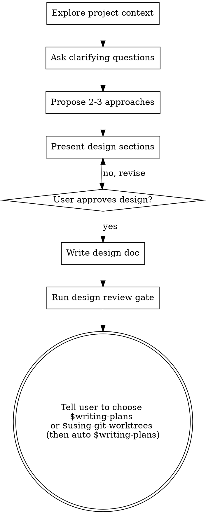

# Brainstorming Ideas Into Designs

## Overview

Help turn ideas into fully formed designs and specs through natural collaborative dialogue.

Classify scope first. Use a lightweight path for clear mechanical changes and the full design path only when the task requires genuine decisions.

<HARD-GATE>
On the full design path, do not implement until the design has been presented and approved. This gate does not apply to the lightweight path.
</HARD-GATE>

<CONSTITUTION-GATE>
Before starting the full design path, you **MUST**:
1. Read `.agent/memory/constitution-core.md` first, then return to `.agent/memory/constitution.md` only if the core entry is insufficient for the active design question.
2. Based on feature scope, load the relevant rule documents:
   - Backend (GraphQL/API/DB changes) → Read `.agent/memory/rules-core/base-engine.md`
   - Frontend Web (UI/components/pages) → Read `.agent/memory/rules-core/base-web.md`
   - Flutter App → Read `.agent/memory/rules-core/base-app.md`
   - Full-stack → Read **ALL** relevant `rules-core/*` files first, then the full rule appendices only when needed
3. Read `docs/memory/index.yaml` before opening module memory files so you only load the relevant module briefs for the design scope.
4. All design proposals must comply with the Constitution. If a design requires violating a constitutional rule, explicitly flag it and justify the exception.
</CONSTITUTION-GATE>

## Scope Classification

Classify the request before creating a checklist, asking questions, or proposing alternatives. Use the smallest process that safely fits the task. Explicit user constraints such as “small change”, “minimal change”, or “do not overdesign” are scope requirements.

File count alone does not determine complexity. A mechanical change may touch multiple packages or generated artifacts and still use the lightweight path.

## No Overdesign or Redundant Design

Design only what the current approved requirements and verified constraints need. Every proposed component, abstraction, interface, dependency, configuration option, compatibility path, or refactor must trace to a current requirement, an observed codebase constraint, or a concrete risk that must be handled now.

- Prefer the smallest change that follows an existing project pattern.
- Do not add speculative extension points, generic frameworks, future-proofing layers, parallel implementations, duplicate fallbacks, or abstractions for hypothetical reuse.
- Do not broaden a focused request into adjacent cleanup, architecture modernization, or unrelated refactoring.
- Do not split code or responsibilities merely to make the design appear more modular; add a boundary only when it gives the current work a clear ownership, contract, or testability benefit.
- When two designs satisfy the requirements equally well, choose the one with fewer new concepts, files, dependencies, and runtime paths.
- Before approval, remove every design element whose absence would not prevent a stated requirement, violate a project rule, or leave a demonstrated risk unaddressed.

The full design path permits deeper analysis, not a larger solution.

### Lightweight Path

Use this path when the requested outcome is explicit, follows an existing pattern, requires no unresolved product or architecture decision, and introduces no migration, compatibility strategy, permission or security boundary, billing behavior, or irreversible operation.

1. Inspect only the files and project rules needed to confirm the existing pattern and impact.
2. State the implementation boundary in one or two sentences.
3. If the user requested implementation, treat that request as approval for the obvious existing-pattern implementation and proceed.
4. Run focused verification and report concisely.

Do not create a task tracker, ask questions whose answers are already discoverable, manufacture alternatives, request separate design approval, write a design document, invoke technical-proposal review, or force a planning handoff.

Escalate to the full design path only when inspection reveals a real design decision, ambiguity, migration or data-loss risk, compatibility choice, new contract semantics, security or billing impact, irreversible action, or materially expanded scope. Explain the concrete reason; do not escalate merely because several files or applications are involved.

If the user explicitly invokes another skill such as `$writing-plans`, `$requesting-code-review`, or `$archiving-module-memory`, honor that request even for a lightweight change.

### Full Design Path

Use the remaining workflow for substantive changes that require genuine design decisions.

## Checklist

On the full design path, create a task for each applicable item and complete them in order:

1. **Load constitution & rules** — read `.agent/memory/constitution-core.md` first, then only the relevant rule files / full appendices for the active scope
2. **Route memory first** — read `docs/memory/index.yaml` and identify the 1-2 relevant module briefs
3. **Read module memory** — read the relevant `docs/modules/<module>.md` brief files and only open `docs/modules-details/...` if the brief is insufficient
4. **Explore project context** — check files, docs, recent commits
5. **Ask clarifying questions** — only for unresolved information, one at a time
6. **Check for Figma assets** — only if the user explicitly mentions Figma, design links, or wants Figma-accurate implementation, record the links provided
7. **Compare credible approaches** — only when materially different approaches actually exist
8. **Present design** — scaled to complexity, then get coherent user approval
9. **Constitution compliance check** — verify the approved design does not violate constitutional rules (Dolphin Engine, Monorepo Context, Code Integrity, etc.)
10. **Write design doc** — save to `docs/plans/YYYY-MM-DD-<topic>-design.md`; include a **Figma References** section if links were collected
11. **Run design review gate** — invoke `$evaluating-technical-proposals` on the completed design doc before planning
12. **Transition to planning setup** — Tell the user that the next manual choice is either `$writing-plans`, or `$using-git-worktrees` first and then automatic continuation into `$writing-plans`, but only after the review result is shown

## Process Flow



**For the full design path, the terminal state is showing the design review result and telling the user that they may manually choose either `$writing-plans`, or `$using-git-worktrees` first and then automatic continuation into `$writing-plans`.** Do NOT invoke `$ui-ux-pro-max`, `$figma`, `$executing-plans`, or any other implementation skill. Do NOT run either option automatically before the user chooses.

## The Process

**Loading project rules:**

- Read `.agent/memory/constitution-core.md` first
- Determine scope and load the corresponding `rules-core/*` entrypoints
- Read `docs/memory/index.yaml` before opening module memory files
- Return to `.agent/memory/constitution.md` or full rule appendices only when the core entries are insufficient
- Note any constitutional constraints that will affect the design (e.g., Dolphin Schema-First, No Touching Generated Code, Page Colocation)

**Understanding the idea:**

- **CRITICAL**: Before brainstorming, use `docs/memory/index.yaml` to route to the relevant modules, then read the matching `docs/modules/<module>.md` brief files. Open `docs/modules-details/...` only when the brief does not contain enough detail.
- Check out the current project state first (files, docs, recent commits)
- Before asking detailed questions, assess scope. If the request actually describes multiple independent subsystems, help the user decompose it before refining one branch in detail.
- If the project is too large for a single spec, help the user identify independent sub-projects, their relationships, and the order they should be built. Then brainstorm the first sub-project through the normal design flow. Each sub-project gets its own design → plan → implementation cycle.
- Ask questions one at a time only when the answer is not safely discoverable or inferable
- Prefer multiple choice questions when possible, but open-ended is fine too
- Only one question per message - if a topic needs more exploration, break it into multiple questions

**Figma asset discovery:**

- Only enter this branch when the user explicitly mentions Figma, provides a design link, or asks for Figma-accurate implementation.
- Record all provided Figma URLs (frame/layer links) in a running list during the conversation.
- Do NOT fetch designs or invoke the Figma MCP skill at this stage — only collect and document links.
- If no Figma link is mentioned, skip this branch entirely and continue with the normal design conversation.
- Include collected links in the final design doc under a dedicated **Figma References** section formatted as:
  ```markdown
  ## Figma References

  > **Implementation note:** Tasks referencing these links should use `$figma` (loads `.agent/skills/figma/SKILL.md`).

  - [Description](https://www.figma.com/...)
  ```
- Focus on understanding: purpose, constraints, success criteria

**Exploring approaches:**

- Compare approaches only when at least two materially different, credible approaches exist
- Never invent alternatives to satisfy a quota
- Present options conversationally with your recommendation and reasoning
- Lead with your recommended option and explain why

**Presenting the design:**

- Once you believe you understand what you're building, present the design
- Scale each section to its complexity: a few sentences if straightforward, up to 200-300 words if nuanced
- Prefer one coherent approval; ask after individual sections only when they contain independent decisions
- Cover only relevant topics among architecture, components, data flow, error handling, and testing
- Be ready to go back and clarify if something doesn't make sense

**Design for isolation and clarity:**

- Break the system into smaller units with one clear purpose and well-defined interfaces
- Prefer designs that can be understood and tested independently
- In existing codebases, follow established patterns and only propose refactors that directly support the current goal
- Avoid fragmentation: do not introduce a new unit or interface when an existing boundary can own the behavior cleanly
- For each unit, the design should make clear what it does, how callers use it, and what it depends on. If consumers must read internals to use it correctly, the boundary is not clear enough.

**Inline spec hygiene:**

- Scan the design doc for placeholders, contradictions, and ambiguous requirements before presenting it as ready
- If something could be interpreted two different ways, make the intended interpretation explicit in the doc

## After the Design

**Documentation for the full design path:**

- Write the validated design to `docs/plans/YYYY-MM-DD-<topic>-design.md`
- Use elements-of-style:writing-clearly-and-concisely skill if available
- Leave the design document in the local working tree for human review
- If helpful, use `brainstorming/spec-document-reviewer-prompt.md` as a structural completeness checklist before running the formal design review gate

**Full-path design review gate:**

- After the design doc is written, invoke `.agent/skills/evaluating-technical-proposals/SKILL.md` against that design as a mandatory review gate.
- Treat this review as part of the brainstorming flow, not as optional commentary.
- Present the gate result before any planning handoff.
- If the review returns `BLOCKED` or `REVISE`, do not imply readiness for implementation. Revise the design or wait for the user's direction.
- If the review returns `READY_FOR_MANUAL_WRITE_PLAN`, you may tell the user that they may manually choose either direct `$writing-plans`, or `$using-git-worktrees` first and then automatic continuation into `$writing-plans`.

**Implementation:**

- Instruct the user to choose either direct `$writing-plans`, or `$using-git-worktrees` first if they want isolated setup before planning.
- This handoff is advisory only. The user alone decides whether to enter `$writing-plans` directly or start with `$using-git-worktrees`.
- If the user manually chooses `$using-git-worktrees` from this handoff and setup succeeds without a new decision point, automatic continuation into `$writing-plans` is allowed.
- Do NOT invoke any other skill, and do NOT proceed until the user manually chooses one of those planning entry options.

## Key Principles

- **One question at a time** - Don't overwhelm with multiple questions
- **Multiple choice preferred** - Easier to answer than open-ended when possible
- **YAGNI ruthlessly** - Remove unnecessary features from all designs
- **No overdesign or redundancy** - Every design element must earn its place through a current requirement, constraint, or demonstrated risk
- **Explore real alternatives** - Compare alternatives only when they genuinely exist
- **Scale the process** - Apply YAGNI to ceremony as well as design
- **Incremental validation** - Present design, get approval before moving on
- **Be flexible** - Go back and clarify when something doesn't make sense
