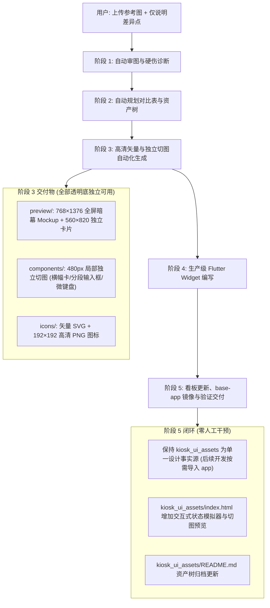

# Kiosk Screen Redesign & Asset Generation Skill

## Overview

本技能专用于处理用户上传的竞品/参考 Kiosk 终端界面截图（如欢迎主屏、扫码加购页、会员登录弹窗、手动输码弹窗、聚合支付页、小票打印页等）。

**核心机制：通用要求全部内置默认生效，用户无需反复重复冗长指令。用户只需上传设计图，并对不同场景的“差异化业务特征”（如“只要手机号”、“支持双语”、“增加扫码/刷脸”）进行极简补充，AI 即可全自动完成升维重构、独立切图拆解、Flutter 代码编写、工程镜像与看板更新。**

---

## 🧠 通用内置默认约定（用户无需重复说明）

只要用户上传了 Kiosk 界面或弹窗截图，无论用户的 Prompt 多么简短（例如只发了一句“重新设计这个界面”或“这个弹窗只要手机号”），**AI 必须自动默认执行以下全部通用约定，无需用户每次提示**：

| 内置约定维度                         | 默认行为与铁律 (AI 自动生效)                                                                                                                                                                                                                                                                                                                                                                         |
| :----------------------------------- | :--------------------------------------------------------------------------------------------------------------------------------------------------------------------------------------------------------------------------------------------------------------------------------------------------------------------------------------------------------------------------------------------------- |
| **1. 抄袭优化非生搬硬套**            | 默认以“抄袭优化、升维重构”为原则，主动诊断并修复原设计的交互硬伤（按键边界、文字分段、状态反馈、兜底通道等），打造高科技轻奢质感。                                                                                                                                                                                                                                                                   |
| **2. 独立资产四级拆解**              | 默认输出 4 级完全解耦的独立资产： ① **效果大图 (preview)**：全屏暗幕拟真图（768×1376）+ 独立透明底卡片（560×820）； ② **局部组件 (components)**：独立透明底切片（480px 宽度规范，如横幅卡、输入框、微键盘）； ③ **矢量图标 (icons)**：页面专属图标（SVG 源码 + 192×192 高清 PNG）； ④ **Flutter源码 (flutter)**：生产级 StatefulWidget，提供 `show(context)` 静态入口与事件闭环。        |
| **3. 规范化按页分包归档**            | 默认根据业务场景自动归入 `kiosk_ui_assets/pages/XX_page_name/`，结构统一规范： • 欢迎页 ➔ `01_welcome_screen/` • 扫码加购/条码 ➔ `02_scan_cart/` • 会员登录 ➔ `03_member_login/` • 聚合收银支付 ➔ `04_payment_methods/` • 小票打印完成 ➔ `05_receipt_success/` • 新业务场景按序递增（如 `06_xxx`）。                                                                               |
| **4. 绝对零覆盖保护**                | 严禁覆盖任何已有文件或既往版本，所有新文件使用语义化新命名独立增量沉淀。                                                                                                                                                                                                                                                                                                                             |
| **5. 沉淀于 kiosk_ui_assets 设计库** | 所有切图、大图、组件、图标与 Flutter 代码严格在根目录 `kiosk_ui_assets/` 统一沉淀与维护。**不提前复制到 `base-app`**，待后续正式开发接入阶段再按需从 `kiosk_ui_assets` 复制对应素材，确保 app 工程目录在设计评审期保持干净整洁。                                                                                                                                                                     |
| **6. 自动更新 index.html 看板**      | 默认在根目录 `kiosk_ui_assets/index.html` 对应 Tab 挂载真机交互模拟器（支持多状态切换）、切图资产网格、图标展示及集成代码。                                                                                                                                                                                                                                                                          |
| **7. 立式触屏大屏交互规范**          | ① **严禁纯文字浮空按键**：所有按键必须带有独立实体圆角卡片底色（`#FFFFFF`）+ `1.2px` 边框 + 柔和投影（`0 3px 6px rgba(0,0,0,0.04)`）； ② **科学空格分段**：手机号强制 `3-4-4` 分段，商品条码强制 `3-4-6` 分段，必须配动态位数胶囊徽章； ③ **严格状态防误触**：未输满有效位数前按钮严格置灰禁用，输满瞬间平滑激活皇家蓝大按钮； ④ **退路畅通**：底部必须保留快捷游客跳过通道或店员求助通道。 |

---

## 🎯 用户极简交互范式 (User Prompting Examples)

得益于上述内置约定，用户**不需要**每次复制大段说明，只需上传图片并说明场景差异即可：

### 示例 1（极简场景：无特殊业务限制）

> **用户输入**：`[上传设计图] 帮我重新设计这份下单界面`
> **AI 行为**：自动识别页面类型（如加购页），自动按 7 大内置约定完成诊断、重构、切图解耦、Flutter 组件、镜像与看板更新。

### 示例 2（差异点补充：精简登录方式）

> **用户输入**：`[上传设计图] 这是会员登录弹窗，只要手机号就行`
> **AI 行为**：内置约定全部自动生效；业务上精准剔除模棱两可的“会员号”，专注 11 位手机号、3-4-4 动态分段、位数校验及会员权益激励卡。

### 示例 3（差异点补充：支付方式拓展）

> **用户输入**：`[上传设计图] 这是支付方式选择页，需要支持微信、支付宝、云闪付和扫码刷脸`
> **AI 行为**：内置约定全部自动生效；在 `04_payment_methods` 下拆解出微信/支付宝大图标、支付渠道卡片与聚合支付组件。

### 示例 4（差异点补充：视觉风格微调）

> **用户输入**：`[上传设计图] 这个弹窗背景要纯白色，整体更清爽简洁一些`
> **AI 行为**：内置约定全部自动生效；界面严格遵循白底极简风，按键保留高对比触控卡片边界。

---

## 📋 标准自动化执行工作流 (Autonomous 5-Step Workflow)

### 阶段 1：自动审图与硬伤诊断 (Analysis & Diagnosis)

1. 使用 `view_file` 检查用户图片；
2. 提取用户提出的**差异点**（如特定登录方式、语言要求、支付渠道等）；
3. 诊断原图的体验硬伤（按键触感、排版分段、提交约束、品牌氛围、退路设计）；
4. 自动确定目标子目录 `kiosk_ui_assets/pages/XX_page_name/`。

### 阶段 2：制定重构方案 (Implementation Plan)

1. 在 `implementation_plan.md` 中输出对比表（原图缺陷 vs 升维重构策略）与待生成文件树；
2. 明确差异点的落地设计。

### 阶段 3：高清切图与组件生成 (Asset Generation)

1. **生成矢量与光栅图标 (`icons/`)**：
   - 编写高质量 SVG 图标源码；
   - 利用 Swift/AppKit 自动化脚本秒级渲染为 `192×192` 透明底 PNG。
2. **生成局部独立组件 (`components/`)**：
   - 权益横幅卡（`480×110`）
   - 分段高亮数字输入框（`480×76`）
   - 实体高质感数字微键盘（`480×340`）
   - 确保每个组件即使单独放到别的页面，也是一张完整立即可用的切图！
3. **生成整体预览大图 (`preview/`)**：
   - 独立透明底卡片（`560×820`）
   - 终端全屏暗幕拟真图（`768×1376`）

### 阶段 4：生产级 Flutter Widget 编写 (Flutter Code)

1. 编写自闭环 StatefulWidget，内置静态呼出方法 `DialogXXX.show(context)`；
2. 包含动态空格分段算法、实时位数校验、InkWell 水波纹触觉反馈；
3. 支持外部成功回调、游客直接跳过回调与店员协助回调。

### 阶段 5：看板升级、文档归档与交付 (Showcase & Verification)

1. 保持 `kiosk_ui_assets/` 作为独立设计资产的单一可信源，不提前向 `base-app` 拷入未联调素材；待后续进入业务开发阶段时，再按需挑选复制至 `base-app/assets/images/kiosk/`；
2. 更新 `kiosk_ui_assets/index.html` 对应 Tab，将占位符替换为真实可交互模拟器；
3. 更新 `kiosk_ui_assets/README.md` 资产树；
4. 生成 `walkthrough.md`（含 Before vs After 卡片式走查），向用户汇报交付。

---

## 📚 详细规范参考索引

- [`references/directory-architecture.md`](references/directory-architecture.md) — 目录分层架构、命名规范与镜像路径映射。
- [`references/visual-guidelines.md`](references/visual-guidelines.md) — Kiosk 立式大屏色彩、实体卡片按键、动态空格分段、阴影与层级规范。
- [`references/asset-generation-scripts.md`](references/asset-generation-scripts.md) — Swift / AppKit 原生渲染脚本模版、坐标转换与防双倍缩放指南。
- [`references/flutter-integration-patterns.md`](references/flutter-integration-patterns.md) — Flutter 弹窗与页面架构规范、分段算法与按键封装。
