# Test-Driven Development (TDD)

## Overview

Write the test first. Watch it fail. Write minimal code to pass.

This skill combines strict Red-Green-Refactor discipline with adversarial test design. TDD without realistic scenario discovery misses bugs. Scenario discovery without strict TDD becomes tests-after.

**Core principle:** If you didn't watch the test fail, you don't know if it tests the right thing.

**Second principle:** If you only tested the happy path, you don't know if the behavior survives the real world.

**Violating the letter of the rules is violating the spirit of the rules.**

## When to Use

**Always:**
- New features
- Bug fixes
- Refactoring
- Behavior changes

**Exceptions (ask your human partner):**
- Throwaway prototypes
- Generated code
- Configuration files

Thinking "skip TDD just this once"? Stop. That's rationalization.

## The Iron Laws

```
1. NO PRODUCTION CODE WITHOUT A FAILING TEST FIRST
2. NO "REFERENCE IMPLEMENTATION" KEPT AFTER WRITING CODE TOO EARLY
3. NO MIXING UNRELATED CONCERNS IN THE SAME TDD CYCLE
4. NO CLAIMING BEHAVIOR IS TESTED WHEN ONLY THE MOCK IS TESTED
```

Write code before the test? Delete it. Start over.

**No exceptions:**
- Don't keep it as "reference"
- Don't "adapt" it while writing tests
- Don't look at it
- Delete means delete

Implement fresh from tests. Period.

## Two-Layer Model

Use two layers every time.

### Layer 1: Risk Discovery

Before each testing wave, identify all relevant scenarios across these dimensions:
- Happy Path
- Edge & Limits
- User Chaos
- System & Concurrency
- FIRST / Testability
- Dependency / Mock Strategy

The goal here is breadth. Do **not** artificially limit how many scenarios you discover.

### Layer 2: TDD Execution

After building the risk map, choose the **current smallest, highest-value, cohesive testable target** for the next Red-Green-Refactor cycle.

The goal here is focus. Do **not** try to implement the whole risk map at once.

**Important distinction:**
- Don't limit discovery to one scenario
- Do limit each TDD cycle to one behavior or one tightly related rule cluster
- Multiple related examples are allowed when they prove the same rule
- Split the cycle when failures would require different design decisions

## What Counts as a Cohesive Target

**Good cohesive targets:**
- One validation rule with nearby boundary values
- One state transition with a few illegal predecessor states
- One retry or timeout policy with closely related failure modes
- One idempotency rule under duplicate submission conditions

**Split the cycle when you are mixing:**
- Happy path and race conditions
- Input validation and third-party outage behavior
- Token expiry and distributed locking
- Precision rules and state-machine violations

If the test name needs "and", split it.

If the implementation would need multiple unrelated branches, split it.

If the failure could be caused by more than one missing behavior, split it.

## Risk-Driven Red-Green-Refactor

```dot
digraph tdd_cycle {
    rankdir=LR;
    map [label="Risk Map\nDiscover scenarios", shape=box, style=filled, fillcolor="#fff2cc"];
    pick [label="Pick next\ncohesive target", shape=diamond];
    red [label="RED\nWrite failing test", shape=box, style=filled, fillcolor="#ffcccc"];
    verify_red [label="Verify RED\nfails correctly", shape=diamond];
    green [label="GREEN\nMinimal code", shape=box, style=filled, fillcolor="#ccffcc"];
    verify_green [label="Verify GREEN\npasses cleanly", shape=diamond];
    refactor [label="REFACTOR\nClean up", shape=box, style=filled, fillcolor="#ccccff"];

    map -> pick;
    pick -> red;
    red -> verify_red;
    verify_red -> red [label="wrong failure"];
    verify_red -> green [label="expected failure"];
    green -> verify_green;
    verify_green -> green [label="not green"];
    verify_green -> refactor [label="green"];
    refactor -> verify_green [label="stay green"];
    verify_green -> map [label="next slice"];
}
```



### Step 0: Build or Refresh the Risk Map

Before writing the next test, ask:
- What is the smallest success path?
- What are the important edge values?
- How can the user behave badly or unpredictably?
- Where can concurrency break correctness?
- What dependencies can stall, replay, lie, or partially fail?
- Can I reproduce these behaviors cheaply and deterministically?

List as many relevant scenarios as needed. Then sort them by:
- Business risk
- Likelihood
- Cost of reproduction
- Design leverage

### Step 1: Pick the Next Slice

Choose the next smallest cohesive target from the risk map.

Usually start with one of these:
- The smallest happy path proving the business rule exists
- The smallest failure case proving the rule has teeth
- The smallest regression that reproduces the bug

Do **not** jump to the most dramatic concurrency or dependency disaster if the core rule is still undefined.

### RED - Write Failing Test

Write one minimal failing test for the current slice.

**Requirements:**
- One behavior or one tightly related rule cluster
- Clear name
- Real code path
- Deterministic setup
- No mocks unless unavoidable

<Good>
```typescript
test('rejects empty email', async () => {
  const result = await submitForm({ email: '' });
  expect(result.error).toBe('Email required');
});
```
Defines one rule, shows intent, proves behavior
</Good>

<Bad>
```typescript
test('validates form and retries payment and handles timeout', async () => {
  // too many concerns
});
```
Multiple rules, unclear failure, oversized slice
</Bad>

### Verify RED - Watch It Fail

**MANDATORY. Never skip.**

```bash
npm test path/to/test.test.ts
```

Confirm:
- Test fails, not errors
- Failure message is expected
- Fails because behavior is missing, not because setup is broken

**Test passes?** You're testing existing behavior or wrote too much setup. Fix the test.

**Test errors?** Fix the test harness and run again until it fails for the right reason.

If this is a concurrency, timeout, or retry case, make the harness deterministic before moving on. Sleeping and hoping is not TDD.

### GREEN - Minimal Code

Write the simplest code that makes the current slice pass.

Don't:
- Add future edge-case handling unless this test demands it
- Refactor adjacent code "while you're here"
- Build generic abstractions for scenarios not yet tested
- Implement three risk-map items because you already know they're coming

Minimal green keeps the signal clean.

### Verify GREEN - Watch It Pass

**MANDATORY.**

```bash
npm test path/to/test.test.ts
```

Confirm:
- The target test passes
- Related tests still pass
- Output is clean: no warnings, timeouts, or hidden errors

**Test fails?** Fix the code, not the test.

**Other tests fail?** Stop and fix them now.

### REFACTOR - Clean Up

After green only:
- Remove duplication
- Improve names
- Extract helpers
- Tighten interfaces
- Improve dependency seams for the next difficult scenario

Keep tests green. Don't add behavior.

### Repeat

Return to the risk map. Choose the next smallest high-value slice.

## Building the Risk Map

Use these prompts to expand scenarios.

### 1. Happy Path

Ask:
- What is the smallest end-to-end success flow?
- What is the first baby-step test proving the rule exists?

### 2. Edge & Limits

Look for:
- Zero, one, max, min, empty, null, negative
- Overflow, truncation, rounding, precision loss
- Timezone shifts, DST, leap year, month-end, expiry windows
- Duplicate keys, malformed payloads, giant fields, Unicode weirdness

### 3. User Chaos

Look for:
- Double click, duplicate submit, refresh and retry
- Back button and replay
- Out-of-order actions that break the state machine
- Long idle time before submit
- Cancel, resume, partial completion, repeated callbacks

### 4. System & Concurrency

Look for:
- Race conditions
- Lost updates
- Duplicate processing
- Oversell or over-allocation
- Deadlock or lock contention
- Eventual consistency gaps
- Concurrent workers or webhook replay

### 5. FIRST / Testability

Ask:
- Can time be controlled?
- Can randomness, IDs, retries, and scheduling be controlled?
- Can faults be injected deterministically?
- Does the code expose seams for isolation without lying about behavior?
- Is the only way to test this with sleep, global state, or manual timing? If so, improve the design.

### 6. Dependency / Mock Strategy

Ask:
- What should remain real?
- What must be mocked, faked, or simulated?
- At what layer should the failure be injected?
- Am I testing business behavior or just proving the mock behaves like the mock?

## Mocking and Fault Injection

Mocks are isolation tools, not the subject of the test.

**Rules:**
1. Prefer real domain behavior over mock-driven assertions
2. Mock at the lowest useful boundary
3. Mock only after understanding the dependency chain
4. Mirror real response structures completely
5. Use fake clocks, deterministic schedulers, barriers, and fault injection instead of sleeps when possible
6. If mock setup is more complex than the behavior under test, reconsider the design or write a higher-level test

When writing or changing mocks, read @testing-anti-patterns.md.

## Good Tests

| Quality | Good | Bad |
|---------|------|-----|
| **Minimal** | One behavior or one tight rule cluster | Three unrelated concerns in one test |
| **Clear** | Name describes behavior | `test('test1')` |
| **Deterministic** | Failure reason is stable | Depends on timing luck |
| **Shows intent** | Demonstrates desired API and rule | Obscures what code should do |

## Common Rationalizations

| Excuse | Reality |
|--------|---------|
| "Too simple to test" | Simple code breaks. Test takes seconds. |
| "I'll test after" | Tests that pass immediately prove nothing. |
| "I already manually tested it" | Ad-hoc checks are not repeatable proof. |
| "I already found 20 scenarios, I'll implement a bunch now" | Wide discovery is good. Wide implementation destroys signal. |
| "These edge cases are related enough" | If they need different branches or failure reasons, split them. |
| "I'll mock this to be safe" | Mocking without understanding hides the real behavior. |
| "Need to explore first" | Fine. Throw away exploration, then start with TDD. |
| "TDD will slow me down" | Debugging production races is slower. |
| "This concurrency bug is too hard to test" | Build a deterministic harness or improve the design seam. |

## Red Flags - STOP and Start Over

- Code before test
- Test written after implementation
- Test passes immediately
- Can't explain why the test failed
- One cycle tries to cover unrelated concerns
- Concurrency tests depend on sleep and luck
- Mock setup dominates the test
- Tests added "later"
- Rationalizing "just this once"

**All of these mean: Stop. Reduce the slice. Restore RED first.**

## Verification Checklist

Before marking work complete:

- [ ] Built or refreshed the risk map
- [ ] Identified the current smallest cohesive target
- [ ] Watched the test fail for the expected reason
- [ ] Wrote minimal code to pass that target
- [ ] Verified the test passes cleanly
- [ ] Refactored without changing behavior
- [ ] Covered important edge cases, chaos cases, or dependency failures through additional slices
- [ ] Used mocks only where justified
- [ ] All relevant tests pass

Can't check these boxes? You skipped part of TDD. Start over.

## When Stuck

| Problem | Solution |
|---------|----------|
| Don't know what to test first | Write the smallest desired behavior or the smallest bug reproduction. |
| Too many scary scenarios | Build the risk map, then pick one cohesive slice. |
| Test is too complicated | Design is too complicated. Simplify the interface or expose better seams. |
| Need to mock everything | Code is too coupled. Push dependencies outward. |
| Concurrency test is flaky | Control scheduling explicitly. Don't use sleeps as proof. |
| External failure is hard to reproduce | Add fault injection, fakes, or deterministic transport hooks. |

## Debugging Integration

Bug found? Reproduce it with a failing test first. Then follow the cycle.

Concurrency or retry bug found? Build the deterministic harness first, then write the failing test.

Never fix bugs without a test that proves the bug existed.

## Testing Anti-Patterns

When adding mocks, fakes, or test-only helpers, read @testing-anti-patterns.md to avoid:
- Testing mock behavior instead of real behavior
- Adding test-only methods to production classes
- Mocking without understanding dependencies
- Creating incomplete mocks that hide structural assumptions
- Treating integration tests as an afterthought

## Final Rule

```
Production code exists because a failing test demanded it.
Risk maps widen your vision.
Tight cycles keep your signal clean.
Without both, it isn't disciplined TDD.
```
